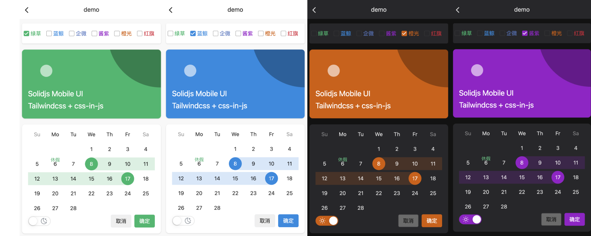

## Solidjs Mobile UI

仍处于开发中的Solidjs Mobile UI 组件库, 暂无发布npm计划

方案不完善，思路还在飞
### Feature components

- `config-provider` 全局配置
- `Button` 按钮
- `Input` 输入框
- `Checkbox` 多选
- `Radio` 单选
- `Switch` 开关
- `Toast` 吐司
- `Dialog` 对话框
- `Popup` 弹窗
- `Picker` 选择器（css实现）
- `Picker2` 选择器（js实现）
- `Calendar` 日历
- `InfiniteScroll` 加载更多
- `ImageView` 图片预览
- `Swipe` 滑块

## FAQ

